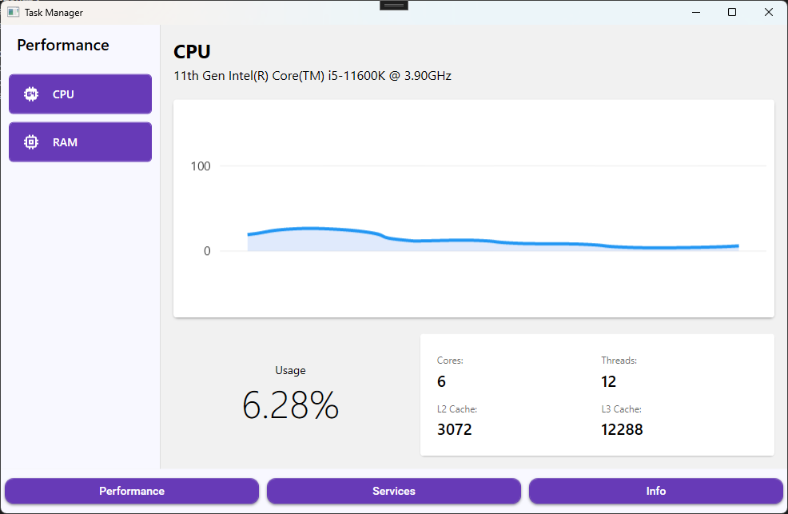
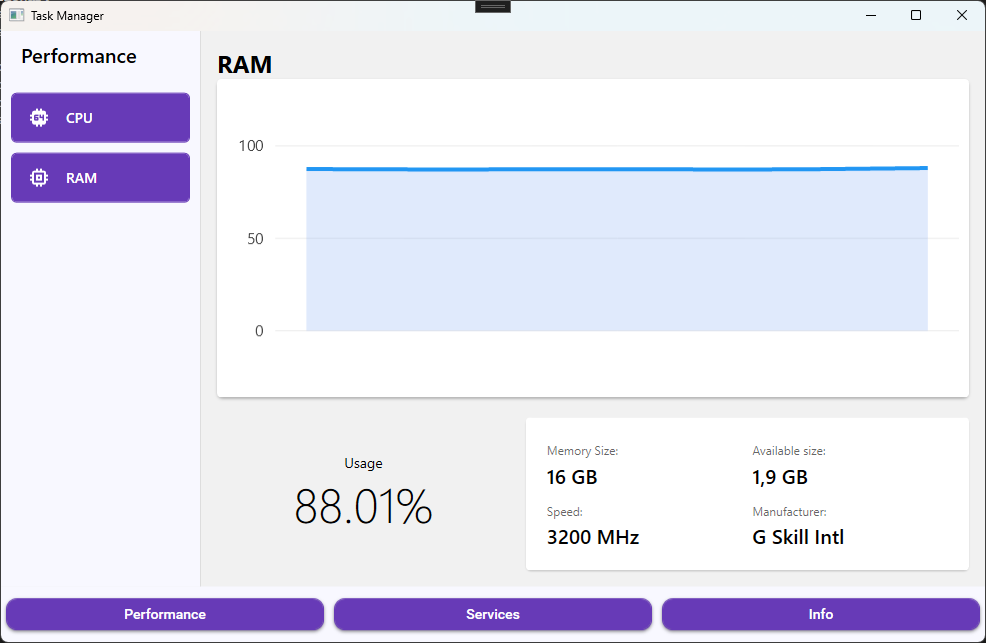
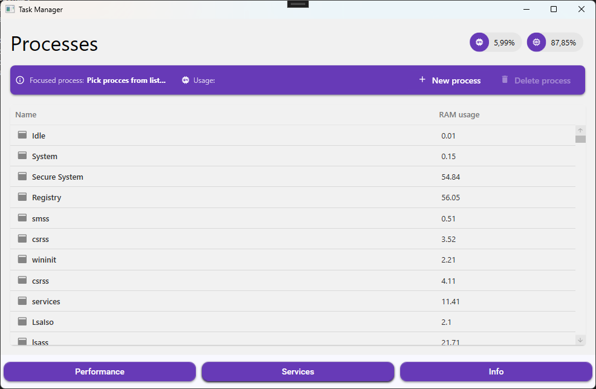
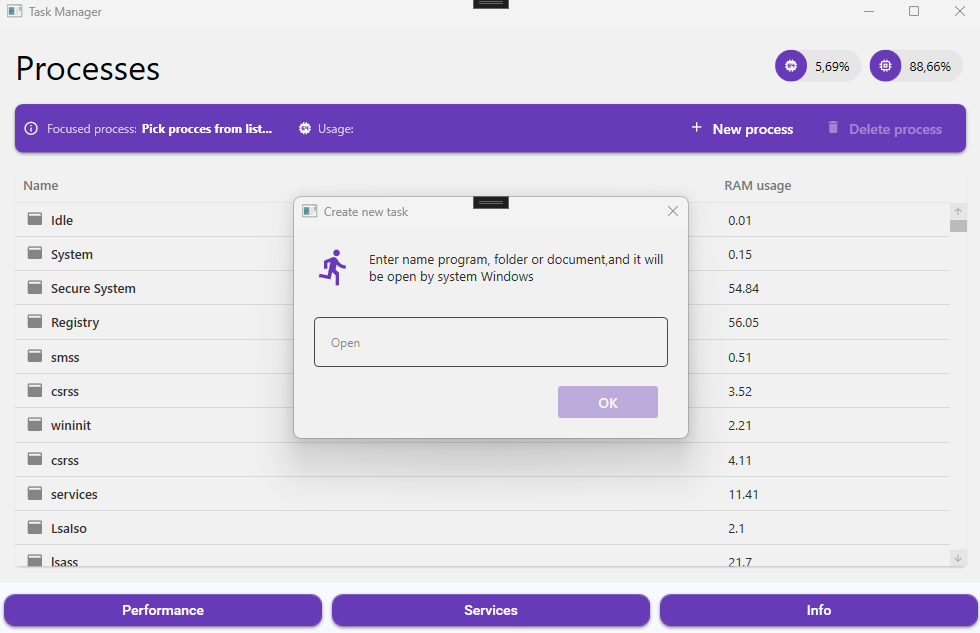
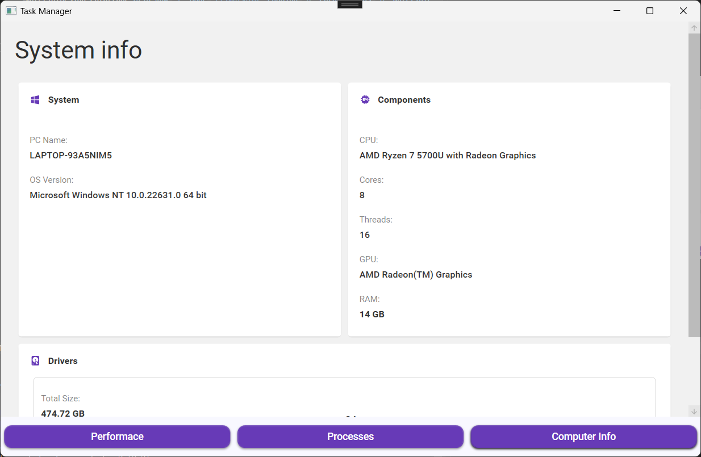
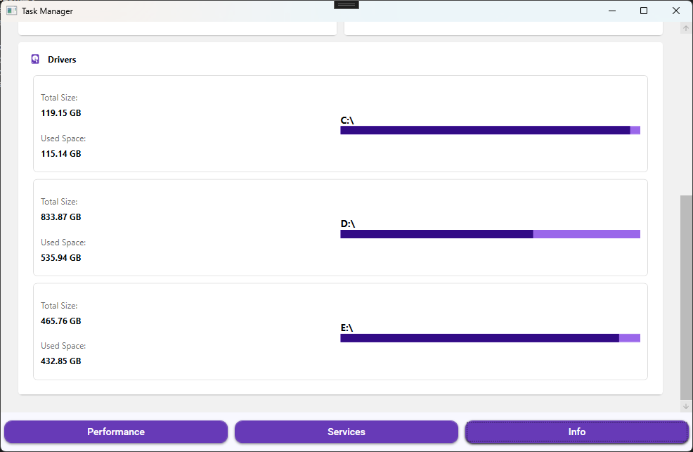

# Windows Task Manager Clone

[English Version](#english) | [Wersja Polska](#polski)

---

## 🇬🇧 English Version

A modern, lightweight Windows Task Manager clone built with **WPF** and **.NET 8**. The application follows the **MVVM** pattern and provides real-time monitoring of system resources with a clean UI powered by Material Design.

## Features
- **Real-time CPU Monitoring**: Track processor load with live charts and detailed info (Cores, Threads, L2/L3 Cache)
- **RAM Usage Tracking**: Dynamic visualization of memory consumption, including total capacity, available memory, speed, and manufacturer.
- **Process Management**:
    - View a list of all running processes and their memory footprint.
    - Monitor specific CPU usage for a selected process.
    - Ability to terminate (kill) avtive processes.
    - Start new tasks directly from the app.
- **System information**: Comprehensive overview of hardware specs including OS version, CPU/GPU model, and logical drive status.
- **Interactive UI**: Smooth data visualization using LiveCharts2 and a modern look thanks to Material Design in XAML.

## Tech Stack
- **Framework**: .NET 8.0 (WPF)
- **Architecture**: MVVM (using CommunityToolkit.Mvvm)
- **UI Components**: Material Design Themes for WPF
- **Charts**: LiveChartsCore (SkiaSharp)
- **System Metrics**: System.Management (WMI) & Performance Counter

## Screenshots
| Performance Monitor | Process List | System Info |
| :---: | :---: | :---: |
|   |   |   |

## Project Structure
The project is organized into clear layers to ensure maintainability:
- **Models**: Data structures for Processes, Drivers, and System Information.
- **ViewModels**: Logic for handling data updates and UI commands (using ObservableProperty and RelayCommand).
- **Views**: XAML-based user interfaces and UserControls.
- **Services**: Core logic for fetching system metrics via WMI and Performance Counters.

---

## 🇵🇱 Wersja Polska

Nowoczesny, lekki klon Menedżera Zadań Windows zbudowany w technologii **WPF** i **.NET 8**. Aplikacja implementuje wzorzec **MVVM** i oferuje monitorowanie zasobów systemowych w czasie rzeczywistym w widoku stworzonym z pomocą Material Design.

## Funkcje
- **Monitorowanie CPU**: Śledzenie obciążenia procesora na wykresach na żywo, oraz szczegółowe dane (rdzenie, wątki, pamięć cache L2/L3).
- **Monitorowanie RAM**: Wizualizacja zużycia pamięci RAM z informacjami o całowitej pojemności pamięci, dostępnej pamięci, prędkości i producencie pamięci.
- **Zarządzanie Procesami**:
     - Lista wszystkich procesów wraz z ich użyciem pamięci.
     - Monitorowanie zużycia CPU dla konkretnego wybranego procesu.
     - Możliwość kończenia aktywnych procesów.
     - Uruchamianie nowych zadań bezpośrednio z aplikacji.
- **Informacje o systemie**: Przegląd wersji systemu operacyjnego, modelu CPU/GPU oraz dysków logicznych

## Użyte Technologie
- **Platforma**: .NET 8.0 (WPF)
- **Architektura**: MVVM (CommunityToolkit.Mvvm)
- **Interfejs**: Material Design Themes for WPF
- **Wykresy**: LiveChartsCore (SkiaSharp)
- **Metryki** System.Management (WMI) & Performance Counter

## Zrzuty ekranu
| Monitor CPU/GPU | Lista procesów | Informacje o systemie |
| :---: | :---: | :---: |
|   |   |   |

## Struktura projektu
Projekt jest podzielony na przejrzyste warstwy aby zapewnić łatwość utrzymania:
- **Models**: Struktury danych dla Procesów, Dysków i informacji o systemie.
- **ViewModels**: Logika obsługi aktualizacji danych i poleceń interfejsu użytkownika (z wykorzystaniem ObservableProperty i RelayCommand).
- **Views**: Interfejsy użytkownika oparte na XAML i kontrolki użytkownika.
- **Services**: Logika do pobierania metryk dla systemu za pośrednictwem WMI i Performance Counter.
